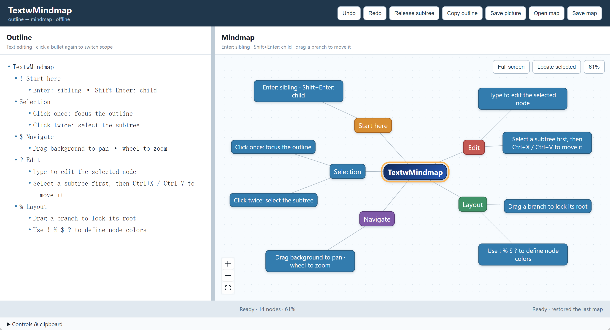
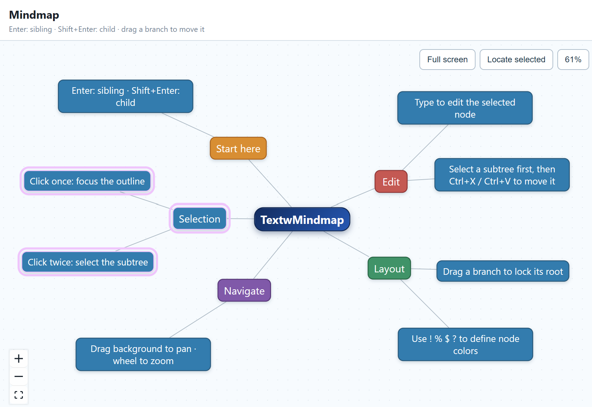

# TextwMindmap

> A plain outline that becomes a living mindmap.

**Write an indented list and get a mindmap, or draw a mindmap and export as formatted text.**
TextwMindmap is an offline-first outline ⇄ mindmap editor that ships as a single HTML file. It needs no account, no install and no server.

Available at https://v2rockets.github.io/TextwMindmap/

[Features](#-features) · [Quick start](#-quick-start) · [Controls](#-controls) · [Built on text2mindmap](#-built-on-text2mindmap) · [Development](#-development) · [License](#-license)



---

## ✨ Features

### Edit in either view
The outline and the map stay in sync both ways. Click a node and its line gets focus in the outline. Type in the outline and the map updates right away. Undo and redo work across both views.

### Restructure with the keyboard
Press **Enter** for a sibling, **Shift+Enter** for a child and **Tab** to change the level. You can build a whole map without touching the mouse.

### Move whole branches with cut & paste
Click a node twice to select its subtree, then **Ctrl/Cmd+X → Ctrl/Cmd+V** to move the branch anywhere. A single click selects one node for text editing; copying in that mode replaces text at the destination instead of moving a tree.



### Take your outline anywhere
Copy once, then paste the same structure into Markdown, OneNote or another note app. Bring a bulleted list back later and TextwMindmap rebuilds the hierarchy for you.

### Attach comments to any node
Add `=>` after a node’s text to attach an explanation or reminder to that node. It stays with the node in the outline but remains hidden from the mindmap.

### Color-code the map from the outline
Prefix a node with `!`, `%`, `$` or `?` to give it an orange, green, purple or red map color. The marker remains editable in the outline and stays hidden from the node label.

### Pick up where you left off
Close the page and reopen it later to restore your last outline, layout, locks and viewport. An empty saved session returns to the built-in guide.

### Smooth canvas navigation
Drag the background to pan and use the wheel to zoom. The dot grid moves with the map, so you always know where you are. Click **Locate selected** or **Full screen** when you need to focus on the canvas.

### Full labels, never truncated
Long text, CJK, emoji, URLs and unbroken strings all wrap cleanly with no `…` cut-offs.

### Save a map or picture
Save the editable map as JSON or export the current mindmap as a PNG.

### One file, fully offline
The release is one self-contained `index.html`. It opens directly from disk (`file://`) and works offline.

---

## 🚀 Quick start

1. Download [`index.html`](index.html).
2. Open it in your browser.
3. Follow the built-in guide, then replace it with your own outline.

---

## 🎮 Controls

| Action | How |
|---|---|
| Select a node and focus its outline line | Click once |
| Select the whole subtree | Click twice |
| Rename the selected node | Just type |
| Add a sibling / child | `Enter` / `Shift+Enter` |
| Indent / outdent | `Tab` / `Shift+Tab` |
| Undo / redo (both views) | `Ctrl/Cmd+Z` / `Ctrl/Cmd+Shift+Z` |
| Move a subtree | Select subtree → `Ctrl/Cmd+X` → `Ctrl/Cmd+V` |
| Copy a subtree | Select subtree → `Ctrl/Cmd+C` |
| Cut only one node’s text (children stay) | Select node → `Ctrl/Cmd+X` |
| Pan / zoom | Drag empty canvas / mouse wheel |
| Drag a branch | Drag a node (only that branch’s root gets locked) |
| Re-center on the selection | **Locate selected** |
| Reset zoom | Click the live zoom percentage |

---

## 🌱 Inspired by text2mindmap

TextwMindmap starts from the idea behind the archived [tobloef/text2mindmap](https://github.com/tobloef/text2mindmap) and keeps its core workflow:

- A tab-indented plain-text outline defines the map hierarchy.
- The outline and the mindmap sit side by side.
- A bubble layout spreads children around their parent.
- Hierarchy-aware visuals set root nodes apart from their descendants.
- Nodes can be dragged, and the layout can be locked or released.
- Documents open and save locally, with no account.

---

## 🛠 Development

<details>
<summary>Run from source, build and check the release</summary>

The implementation lives in `source/`. Internal design documents and the full browser test suite are not included.

```bash
cd source
npm install
npm run dev
```

Rebuild the standalone `index.html`:

```bash
npm run build
```

Run the basic release check:

```bash
node test/basic-smoke.mjs
```

This confirms that the release is self-contained and includes the public demo controls. The full interaction suite stays in the working project used to produce releases.

</details>

---

## 📄 License

MIT. See [LICENSE](LICENSE).
